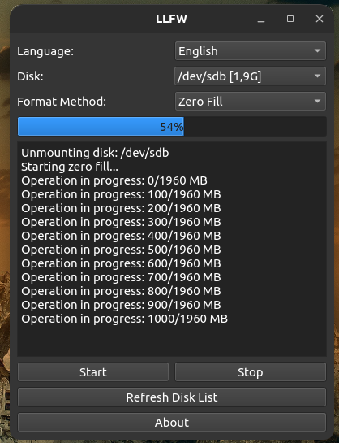

<a href="#">
    
</a>

# LLFW
LLFW is a tool for Linux users that performs low-level format operations on disks. Thanks to its user-friendly interface and powerful features, you can easily perform operations such as filling with zeros, writing random data or secure erase.

NOTE: LLFW CLI Terminal Based Version is Available.: https://github.com/cektor/LLFW-CLI

<h1 align="center">LLFW Logo</h1>

<p align="center">
  
</p>


----------------------

# Linux Screenshot
  

--------------------
Install Git Clone and Python3

Github Package Must Be Installed On Your Device.

git
```bash
sudo apt install git -y
```

Python3
```bash
sudo apt install python3 -y 

```

pip
```bash
sudo apt install python3-pip

```

# Required Libraries

Required Libraries for Debian/Ubuntu
```bash
sudo apt-get install python3-pyqt5
sudo apt-get install qttools5-dev-tools
```


PyQt5
```bash
pip install PyQt5
```
PyQt5-sip
```bash
pip install PyQt5 PyQt5-sip
```

PyQt5-tools
```bash
pip install PyQt5-tools
```
----------------------------------


# Installation
Install LLFW

```bash
sudo git clone https://github.com/cektor/LLFW.git
```
```bash
cd LLFW
```

```bash
sudo python3 llfw.py

```

# To compile

NOTE: For Compilation Process pyinstaller must be installed. To Install If Not Installed.

pip install pyinstaller 

Linux Terminal 
```bash
pytohn3 -m pyinstaller --onefile --windowed llfw.py
```

MacOS VSCode Terminal 
```bash
pyinstaller --onefile --noconsole llfw.py
```

# To install directly on Linux

Linux (based debian) Terminal: Linux (debian based distributions) To install directly from Terminal.
```bash
wget -O Setup_Linux64.deb https://github.com/cektor/LLFW/releases/download/1.00/Setup_Linux64.deb && sudo apt install ./Setup_Linux64.deb && sudo apt-get install -f -y
```


Release Page: https://github.com/cektor/LLFW/releases/tag/1.00

----------------------------------

